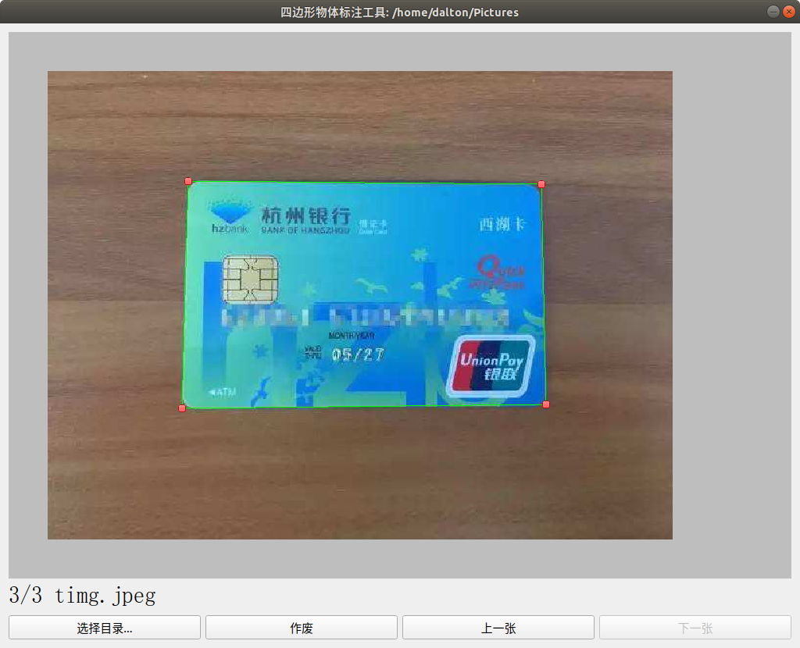

## 用法
拖到四个红色的点让绿线贴合物体边缘即可

## 数据提取
被标注的目录下面会有个`label.sqllite3`文件,读取label表即可获取到物体的四点坐标

## 打包成exe文件

- 文件版本信息文件模板获取, 打开powershell然后输入如下命令获取记事本程序的版本信息文件,修改相关信息即可
```
(py36) C:\Users\logan>pyi-grab_version C:\Windows\system32\notepad.exe
```

- 运行打包命令指定图标和版本信息文件.
```
pyinstaller  --onefile --windowed --icon=main.ico -n "四边形物体标注工具" --version-file=file_version_info.txt --clean main.py
```

## 截图

